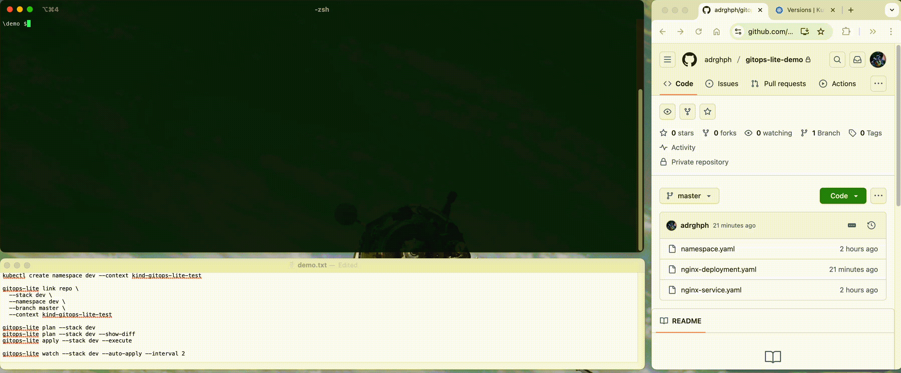

# gitops-lite

GitOps without struggling : no CRDs, no controllers, just plan and apply.



**Requirements:** Python 3.13+, `kubectl`, `git`, `kustomize` (optional)

**Installation:**

```bash
git clone https://github.com/adrghph/gitops-lite.git
cd gitops-lite
pip install -e .
```

## Quick Start

```bash
# 1. Create namespace
kubectl create namespace production --context your-cluster

# 2. Link your Git repo
gitops-lite link https://github.com/user/k8s-manifests \
  --stack production \
  --namespace production \
  --branch main \
  --context your-cluster

# 3. Check changes
gitops-lite plan --stack production

# 4. Apply
gitops-lite apply --stack production --execute

# 5. Watch and auto-apply
gitops-lite watch --stack production --auto-apply --interval 5
```

## Commands

### `link` : Connect a Git repo to your cluster

```bash
gitops-lite link <repo-url> \
  --stack <name> \
  --namespace <namespace> \
  --branch <branch> \
  --context <k8s-context>
```

**Required flags:**
- `--stack` : Unique name for this deployment
- `--namespace` : Target Kubernetes namespace
- `--branch` : Git branch to track
- `--context` : Kubernetes context

### `plan` : Preview changes

```bash
gitops-lite plan --stack <name>
gitops-lite plan --stack <name> --show-diff  # Show detailed diffs
```

### `apply` : Deploy to cluster

```bash
gitops-lite apply --stack <name>              # Dry-run (default)
gitops-lite apply --stack <name> --execute    # Actually apply
gitops-lite apply --stack <name> --execute --prune  # Also remove orphaned resources
```

### `watch` : Continuous sync

```bash
# Watch and show diffs (manual apply)
gitops-lite watch --stack <name> --interval 5

# Watch and auto-apply changes
gitops-lite watch --stack <name> --auto-apply --interval 5
```

**Required flags:**
- `--stack` : Unique name for this deployment
- `--interval` : Check interval in seconds

### `list` / `unlink`

```bash
gitops-lite list              # Show all linked stacks
gitops-lite unlink <name>     # Remove a stack
```

---

## Examples

### Plain YAML manifests

```bash
kubectl create namespace prod --context prod-cluster

gitops-lite link https://github.com/user/manifests \
  --stack prod \
  --namespace prod \
  --branch main \
  --context prod-cluster

gitops-lite plan --stack prod 
gitops-lite plan --stack prod --show-diff
gitops-lite apply --stack prod --execute

gitops-lite watch --stack prod --auto-apply --interval 5
```

### Local development

```bash

kubectl create namespace dev --context minikube

gitops-lite link ./manifests \
  --stack dev \
  --namespace dev \
  --branch main \
  --context minikube

gitops-lite plan --stack dev
gitops-lite plan --stack dev --show-diff
gitops-lite apply --stack dev --execute

gitops-lite watch --stack dev --auto-apply --interval 5
```

### Kustomize overlays

```bash
kubectl create namespace staging --context staging-cluster

gitops-lite link https://github.com/user/repo \
  --stack staging \
  --namespace staging \
  --branch main \
  --context staging-cluster \
  --renderer-type kustomize \
  --kustomize-dir overlays/staging

gitops-lite plan --stack staging
gitops-lite plan --stack staging --show-diff
gitops-lite apply --stack staging --execute

gitops-lite watch --stack staging --auto-apply --interval 5
```

### Kustomize with Helm charts

```bash
# Your kustomization.yaml:
# helmCharts:
#   - name: nginx
#     repo: https://charts.bitnami.com/bitnami
#     version: ...

kubectl create namespace prod --context prod-cluster

gitops-lite link https://github.com/user/repo \
  --stack prod \
  --namespace prod \
  --branch main \
  --context prod-cluster \
  --renderer-type kustomize \
  --kustomize-dir overlays/prod \
  --kustomize-build-args '--enable-helm'

gitops-lite plan --stack prod
gitops-lite plan --stack prod --show-diff
gitops-lite apply --stack prod --execute

gitops-lite watch --stack prod --auto-apply --interval 5
```

---

## More Examples

Complete examples with configurations:

- **[plain-yaml](examples/plain-yaml/)** : Simple YAML manifests
- **[kustomize](examples/kustomize/)** : Base + overlays (dev/prod)
- **[kustomize-with-crd](examples/kustomize-with-crd/)** : Custom resources
- **[harbor-helm](examples/harbor-helm/)** : Container registry
- **[istio-helm](examples/istio-helm/)** : Service mesh (20+ CRDs)
- **[kube-prometheus-stack-helm](examples/kube-prometheus-stack-helm/)** : Monitoring stack

All examples include ready-to-use commands and values files.

---

## Features

**Explicit context** : Always specify which cluster you're targeting (no surprises)

**Application ordering** : Resources applied in safe order (Namespace→CRD→ConfigMap→Service→Deployment→...)

```yaml
# Override with annotation
metadata:
  annotations:
    gitops-lite.io/order: "5"
```

**Auto-injected labels** : All resources get:
- `app.kubernetes.io/managed-by: gitops-lite`
- `gitops-lite.stack: <name>`

**Pruning** : Remove resources not in Git with `--prune`

**Server-side apply** : Uses kubectl server-side apply for robust updates

**Config persisted** : `~/.gitops-lite/config.yaml`

**Remote repos cached** : `~/.gitops-lite/repos/<stack>/` (auto git pull)

**Local repos** : Used directly, no cloning

---

## gitops-lite versus ArgoCD/FluxCD

| gitops-lite | ArgoCD/Flux |
|------------|-------------|
| Runs locally | In-cluster agent |
| No CRDs | Requires CRDs |
| Git polling | Webhooks |
| Simple setup | Complex RBAC |
| You control apply | Automatic |
| Explicit context | Cluster-scoped |

